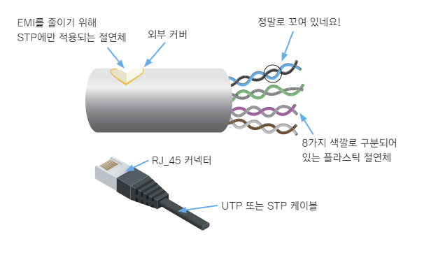
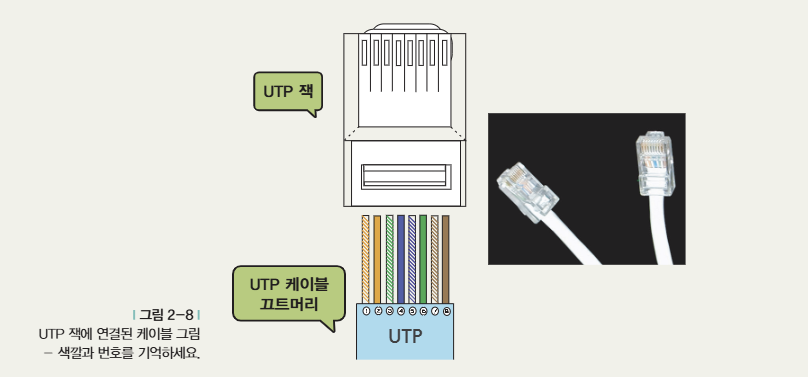

## 04. UTP 케이블만이라도 제대로 알아볼까요?

#### 통신 케이블들이 어디에 들어가는가?
- 장비와 장비의 연결
    - PC-허브-스위치
    - 스위치-스위치
    - 스위치-라우터
    - 라우터-라우터

#### 케이블
- 광케이블
- UTP 케이블
- 동축 케이블 등

### UTP 케이블

- TP : `Twisted-pair` : '꼬인 녀석'
- UTP : `Unshielded Twisted-pair` : '**안 감싼** 꼬인 녀석'
- STP : `Shielded Twisted-pair` : '**감싼** 꼬인 녀석'

 

### 카테고리
- 1 : 주로 전화망에 사용
- 2 : 데이터 최대 4Mbps 속도로 전송
- 3 : 최대 10Mbps속도로 전송. UTP케이블이라고 하면 보통 이 케이블을 이야기할정도로 일반적이었음.
- 4 : 토큰링 네트워크에서 사용되는 케이블. 최대 16Mbps
- 5 : 최대 100Mbps. 기가비트 속도 데이터 전송도 가능해짐
- 6 : 기가비트 이상의 속도에 적합. 최대 10Gbps
- 7 : 주로 10Gbps속도 이상 지원하기 위한 케이블. 아직 일반화되어있지는 않음.

## 05. 케이블, 이 정도만 알면

### 케이블 종류 알기
> 아래 예시로 케이블 종류 표기 법칙?에 대해 알아보자.
#### 10 Base T
- 10 : 속도 (Mbps)
- Base : Baseband용 케이블이라는 뜻
- T : 케이블 종류 또는 전송 최대 거리

 

### 주요 이더넷 케이블 규격

| 규격 | 속도 | 케이블 / 커넥터 | 최대 거리 | 특징 |
| --- | ---: | --- | ---: | --- |
| **10Base-T** | 10Mbps | UTP Cat. 3·4·5 / RJ-45 | 100m | UTP를 사용하는 초기 이더넷 규격 |
| **100Base-TX** | 100Mbps | UTP Cat. 5 | 100m | 대표적인 패스트 이더넷 규격 |
| **100Base-FX** | 100Mbps | 광케이블 / 주로 SC | 2~10km | 광케이블을 사용해 장거리 전송 가능 |
| **1000Base-SX** | 1Gbps | 단파장 광케이블 | 270~550m | 비교적 짧은 거리에서 사용하는 기가비트 광 규격 |
| **1000Base-T** | 1Gbps | UTP Cat. 5, 4페어(8가닥) | 100m | UTP를 사용하는 대표적인 기가비트 이더넷 규격 |

 

### 크로스 케이블과 다이렉트 케이블

UTP 케이블은 8개의 선으로 이루어져 있다. 주로 **1, 2번 핀은 송신**, **3, 6번 핀은 수신**에 사용한다.

| 구분 | 양쪽 선 배열 | 주로 연결하는 장비 | 핵심 |
| --- | --- | --- | --- |
| **다이렉트 케이블** | 양쪽이 같음 `12345678 ↔ 12345678` | PC ↔ 허브·스위치 라우터 ↔ 허브·스위치 | 서로 **다른 종류**의 장비 연결 |
| **크로스 케이블** | 1·2번과 3·6번을 교차 `12345678 ↔ 36145278` | PC ↔ PC 허브·스위치 ↔ 허브·스위치 | 서로 **같은 종류**의 장비 연결 |

> 요즘 장비는 케이블 종류를 자동으로 감지하는 `Auto MDI-X`를 지원하는 경우가 많아 다이렉트와 크로스를 엄격히 구분하지 않아도 된다.

 
