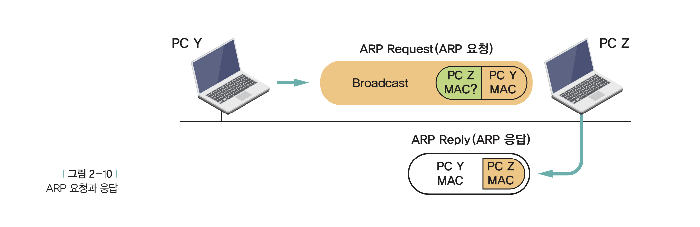

# 06. 맥 어드레스에 대한 이야기

날짜: 2026년 7월 30일
선택: 네트워크
책: 후니의 쉽게 쓴 시스코 네트워킹

# MAC; Media Access Control

네트워크 상에서 서로를 구분해서 인식하기 위한 주소.

## ARP; Address Resolution Protocol

IP 주소를 MAC으로 바꾸는 절차

## 네트워크 안에서의 통신

### 같은 네트워크에 있는 경우



1. Y가 Z의 IP 주소를 알고 있을 때
2. Y는 자신이 속한 네트워크에 있는 모든 PC에 메세지를 보냄 (→ 브로드캐스트)
3. 네트워크에 Z가 있으면 MAC 요구
4. Z가 MAC을 주고 난 후에 통신 시작

### 다른 네트워크에 있는 경우


*브로드캐스트 : 같은 네트워크 내에서만 가능

1. Y가 자신이 속한 네트워크에 있는 모든 PC에 메세지를 보냄
2. Y랑 연결되어 있는 라우터가 Z의 IP주소를 보고 우리 네트워크에 있지 않고 대답하지 않을 것을 앎
3. 라우터가 Y에게 자신의 MAC을 보내줌
4. Y가 라우터에게 정보를 보냄
5. 라우터가 Z에게 있는 네트워크의 라우터로 정보 전달
6. Z가 속해있는 네트워크의 라우터는 Z의 MAC주소를 찾고 그것을 이용해 전달

## MAC 주소란

- 랜카드 · 라우터 · 스위치와 같은 네트워크 장비에 부여되는 고유한 하드웨어 주소
- 길이 48비트 = 6옥텟(octet) = 6바이트 (옥텟 = 8비트 단위)
- 같은 LAN의 장비들은 서로 다른 MAC주소를 가져야 하며, 전 세계적으로도 고유
- 표기는 8비트씩 끊어 `-`, `:`, `.` 등을 사용
    
    ```jsx
    00-60-97-8F-4F-86
    00:60:97:8F:4F:86
    0060.978F.4F86
    ```
    
- 실제로는 48자리 이진수 → 4비트씩 묶은 16진수 12자리로 표현
    
    
    
    ```jsx
    0060.978F.4F86
    
    - 앞 24비트 (00-60-97) : OUI(Organizationally Unique IDentifier), 제조사 식별코드
    - 뒤 24비트 (8F-4F-86) : 제조사가 장비에 부여하는 일련번호(Host Identifier)
    
    MMAC주소 = [제조사 코드 24비트][장비별 일련번호 24비트]
    ```
