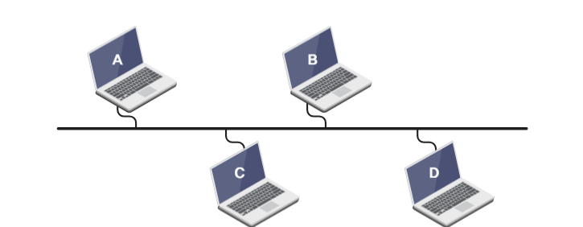
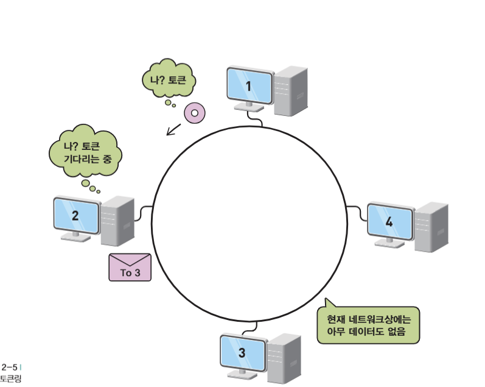

## LAN

- **Local Area Network의 약자로, ‘어느 한정된 공간에서 네트워크를 구성한다’는 것**

ex) 한 사무실에 30대의 컴퓨터가 네트워크로 구성한다면 → 사무실에 LAN을 구축한다고 말함

- **비교되는 개념으로 WAN**
    - Wide Area Network의 약자로, ‘멀리 떨어진 지역을 서로 연결하는 경우
    - 요즘 모두 인터넷 사용으로 대부분 WAN

#### **→ LAN은 한정된 지역에 안에서 네트워크 구축, WAN은 서로 멀리 떨어진 곳을 네트워크로 연결하는 것!**

---

## 이더넷

- 네트워킹의 하나의 방식
    - 네트워킹이란?
        - 장비들이 서로 대화가 가능하도록 묶어주는 것
- CSMA/CD라는 프로토콜 사용

#### CSMA/CD

- Carrier Sense Multiple Access with Collision Detection의 약어
- **우리 네트워크 자원을 쓰고 있는 PC나 서버가 있는지 확인 → Carrier Senese**
    - 즉, 캐리어가 있는 확인
        - 네트워크 상에서 나타내는 신호
- 누군가 네트워크에서 통신한다면, 자신의 신호 기다리고, 네트워크 통신이 없어지면 자신의 데이터 실어서 보냄
- **두 PC가 서버에 동시에 자신의 데이터를 네트워크에 실어 보내면 → Multiple Access(다중 접근)**
- 동 시에 보내려다 부딪히는 경우 → Collision(충돌)
- **데이터를 네트워크에 실어 보내고 다른 PC와 충돌 나지 않았는지 점검 → Collsion Detection(충돌 감지)**

#### → 통신하고자 하는 컴퓨터가 네트워크 상 아무런 통신하지 않으면 데이터를 보내고 잘 도착했는지 살펴본 뒤, 충돌 나면 랜덤한 시간동안 기다렸다가 다시 보내는 방식

---

## 토큰링 방식

- 토큰을 가진 PC만이 네트워크에 데이터를 실어보내는 방식
- 데이터를 다 보내면 다음 PC에 토큰 전달

    → 토큰링은 충돌 발생 X

- 장점 : 성능 미리 예측 가능
- 단점 : 내가 보낼 데이터가 있고, 다른 PC는 보낼 데이터가 없는데도 내 순서가 올 때까지 무한정 대기

