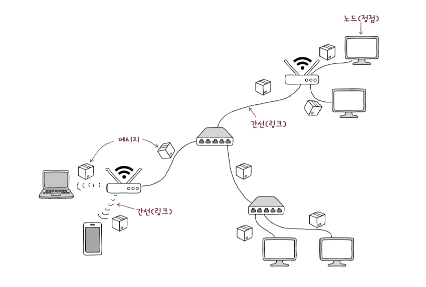
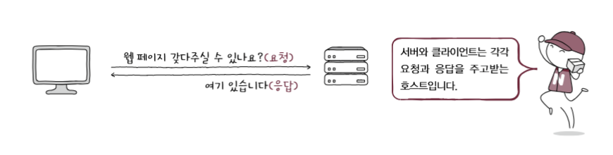
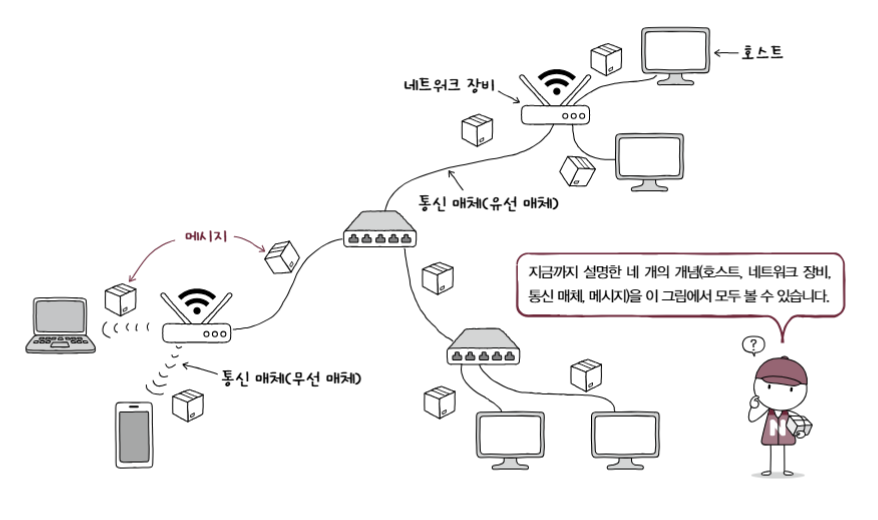
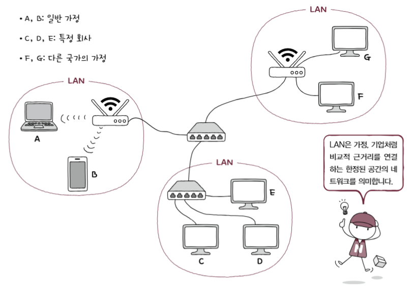
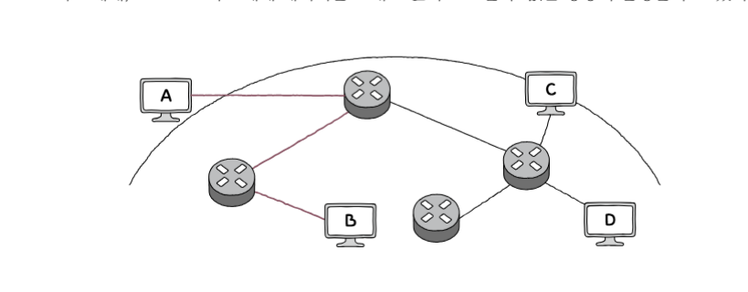
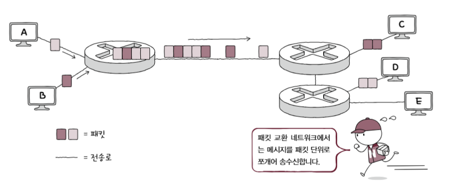

## 네트워크 기본 구조

- **모든 네트워크는 ‘노드’, 노드를 연결하는 ‘간선’, 노드 간 주고받는 ‘메세지’로 구성**
    - 노드는 정보를 주고 받을 수 있는 장치, 간선은 정보를 주고 받을 수 있는 유무선의 통신매체라고 이

- **호스트** : 가장자리 노드를 네트워크에서는 호스트
    - 네트워크의 가장자리이므로, **end system**이라고도 함
- **서버** : ‘어떠한 서비스’를 제공하는 호스트
    - 서비스는 파일(파일 서버), 웹 페이지(웹 서버), 메일(메일 서버)가 될 수 있음
    - serve(제공하다)에서 비롯됨
- **클라이언트** : 서버에게 어떠한 서비스를 요청하고 서버의 응답을 제공하는 호스트

- **네트워크 장비** : 호스트 간 주고받는 정보가 원하는 수신자까지 안정적이고 안전하게 전송할 수 있는 장비
    
    ex) 허브, 스위치, 라우터, 공유
    
- **통신매체** : 노드(호스트, 네트워크 장비 등등)을 연결하는 간선(링크)
    - 유선 매체 : 노드를 유선으로 연결
    - 무선 매체 : 노드를 무선으로 연결
    
    

    
- **메세지** : 통신매체로 연결된 노드가 주고 받는 정보
    
    ex) 웹페이지, 파일, 메일될 수 있음
    

**→ 네트워크 가장자리 노드인 호스트, 중간 노드인 네트워크 장비, 노드를 연결하는 간선인 통신매체, 노드들이 주고 받는 정보인 메세지로 구성**

 

## 범위에 따른 네트워크 분류

### LAN

- **Local Area Network의 약자로, 가까운 지역 연결한 근거리 통신**
    
    ex) 가정, 학교 기업처럼 한정된 공간의 네트워크
    

### WAN

- **Wide Area Nerwork, 먼 지역을 연결하는 광역 통신망**
    - 멀리 떨어진 LAN을 연결할 수 있는 네트워크
    - 인터넷이 WAN으로 분류
- **인터넷을 사용하기 위해 접속하는 WAN은 ISP(Internet Service Provider)라는 서비스 업체 구축 관리**
    - 사용자에게 인터넷 같은 WAN에 연결 가능한 회선을 임대하는 등 관련 서비스 제공
    - ex) KT, LG유플러스, SKT

 

## 메세지 교환 방식에 따른 네트워크 분류

### 회선 교환 방식

- **메세지 전송로인 회선을 설정한 후, 이를 통해 메세지 주고 받는 방식**
- ‘회선을 설정한다’ 는 ‘두 호스트가 연결되었다’, ‘전송로를 확보하였다’라는 말과 같음
- 호스트들에게 메세지를 주고 받기 전, 두 호스트를 연결한 후, 연결된 경로로 메세지 주고 받음
    
    → **주어진 시간 동안 전송된 정보의 양이 비교적 일정하다는 장점**
    
- 회선 스위치 : 호스트 사이에 일대일 전송로 확보하는 네트워크 장비
    
    ex) 전화망 : 누군가에게 전화를 걸면 수신자와 송신자 연결되어야 하며, 연결 설정되면 연결된 전송로를 통해서만 통화 가능
    
    → **회선의 이용 효율 낮아질 수 있음(회선이 끊임없이 이어져 있어야 함)**
    

### 패킷 교환 방식

- **회선 교환 방식 문제점 해결 방식, 메세지를 패킷 단위로 쪼개어 전송**
- **패킷** : 네트워크상에서 송수신되는 메세지 단위

- **회선 교환 방식과 다르게 중간 노드** 거칠 수 있는데, 이때 중간 노드인 패**킷 스위치**는 패**킷이 수신자까지 올바르게 도달할 수 있도록 최적의 경로 결정하거나 패킷 송수신자 식별**하는데 대표적으로 **라우터 and 스위치**
    - **페이로드** : 패킷을 통해 전송하고자 하는 데이터
    - **헤더** : 패킷에 붙는 부가정보, 제어정보
    - **트레일러** : 패킷 뒤에 부가정보, 제어 정보를 담음
    

 

## 주소와 송수신지 유형에 따른 전송방식

- **주소** : 헤더에 담기는 정보로, 송수신자를 특정하는 정보

### 유니캐스트

- **일반적 형태이 송수신 방식, 하나의 메세지에 메세지를 전송하는 방식**
- 송신지와 수신지가 일대일로 메세지 주고받음

### 브로드캐스트

- **자신을 제외한 네트워크상의 모든 호스트에게 전송**
- 브로드케스트가 전송되는 범위는 브로드케스트 도메인
    
    → 브로드케스트 수신지는 브로드케스트 도메인, 자신을 제외한 네트워크상의 모든 호스트
    

### 멀티캐스트

- **네트워크 내의 동일 그룹에 속한 호스트에게만 전송하는 방식**

### 애니캐스트

- **네트워크 내의 동일 그룹에 속한 호스트 중 가장 가까운 호스트에게 전송하는 방식**