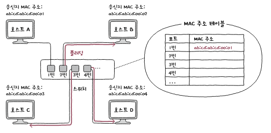
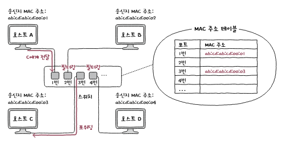
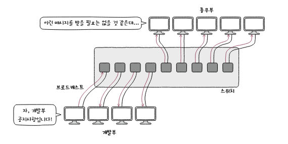
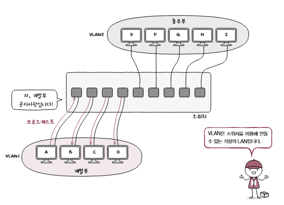
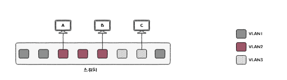
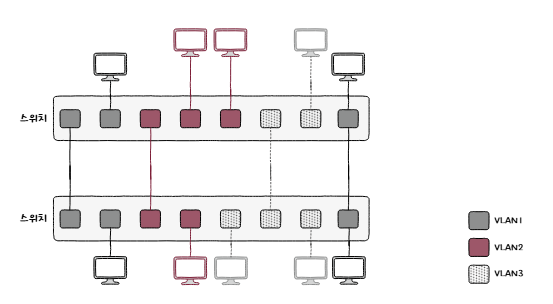

# 02-4 스위치

스위치는 **MAC 주소를 학습**하여 필요한 포트로만 프레임을 전달하는 데이터 링크 계층 장비이다(L2)

## MAC 주소 테이블

- 스위치는 **MAC 주소 테이블**에 `MAC 주소 - 연결 포트`의 대응 관계를 저장한다.

## MAC 주소 학습

스위치는 프레임의 **송신지 MAC 주소**와 프레임이 들어온 포트를 보고 MAC 주소 테이블을 채운다.

1. 처음에는 목적지 MAC 주소가 어느 포트에 있는지 알 수 없음
2. 송신지 MAC 주소와 수신 포트를 테이블에 기록
3. 목적지의 위치를 모르면 프레임을 들어온 포트를 제외한 모든 포트로 전송

### 스위치 기능

- **플러딩(Flooding)**: 목적지 MAC 주소를 모를 때 수신 포트를 제외한 모든 포트로 프레임을 전송하는 것

    

    - 여기서 호스트 B, D는 관련 없는 프레임을 전송받았기 때문에 폐기한다.
    - C는 스위치로 응답 프레임을 전송한다.
    - 이를 통해 MAC 테이블에 C 주소를 기록

 

- **포워딩(Forwarding)**: MAC 주소 테이블을 바탕으로 목적지가 연결된 포트로 프레임을 전송하는 것

- **필터링(Filtering)**: 프레임 보낼지 말지를 결정해, 목적지가 아닌 포트로는 프레임을 보내지 않는다. -> 불필요한 트래픽을 줄인다

    

- **에이징(Aging)**: 일정 시간 동안 프레임을 받지 못한 MAC 주소 테이블 항목을 삭제한다.

> 스위치는 송신지 MAC 주소를 학습하고 목적지 MAC 주소를 조회하여 포워딩 또는 필터링을 수행한다!

## 브리지

- **브리지(Bridge)**: 네트워크 영역을 확장하거나 도메인을 나누는 용도로 사용
- MAC 주소를 학습하고 특정 포트로 프레임을 포워딩하거나 필터링 가능
- 요즘은 기능과 처리 성능이 더 뛰어난 스위치가 브리지 역할을 대부분 대체함

## VLAN

- **VLAN(Virtual LAN)**: 한 대의 스위치로 가상의 LAN을 만드는 방법

### 등장 배경
- 허브는 송신지 포트를 제외한 모든 포트로 신호를 보내기에 불필요 트래픽이 늘어나 성능 저하 유발
- 스위치를 이용해도 굳이 같은 LAN(네트워크)에 속할 필요가 없다.

    

### VLAN 특징
- 한 대의 물리적 스위치로 여러 대 스위치가 있는 것처럼 논리적 단위로 LAN 구획 가능.
- 물리적 위치와 관계없이 같은 VLAN에 속한 호스트를 하나의 LAN처럼 구성 가능
- VLAN마다 브로드캐스트 도메인이 분리됨 
- 한 VLAN의 브로드캐스트는 다른 VLAN으로 전달되지 않음
- 서로 다른 VLAN 간 통신에는 라우터 등 네트워크 계층 이상의 장비가 필요함

    

### 포트 기반 VLAN

- **포트 기반 VLAN**: 스위치의 포트마다 VLAN을 할당하고 해당 포트에 연결된 호스트를 그 VLAN에 포함하는 방식
- 스위치의 포트가 VLAN 결정하는 방식

    

### VLAN 트렁킹

- **VLAN 트렁킹(VLAN Trunking)**: 여러 VLAN의 트래픽을 하나의 스위치 간 연결로 전달하여 VLAN을 확장하는 방식
- 스위치 간 연결에 사용하는 특별한 포트를 **트렁크 포트** 또는 **태그 포트**라고 함
- 특정 VLAN 하나에만 할당된 일반 포트는 **액세스 포트**
- 트렁크 포트로 전달되는 프레임에는 VLAN을 식별할 수 있도록 

     

### MAC 기반 VLAN

- **MAC 기반 VLAN**: 포트가 아니라 프레임의 MAC 주소를 기준으로 호스트가 속할 VLAN을 결정하는 방식
- 호스트가 어느 포트에 연결되더라도 등록된 MAC 주소에 따라 같은 VLAN에 속함