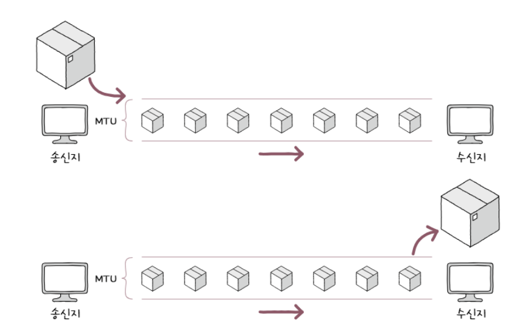
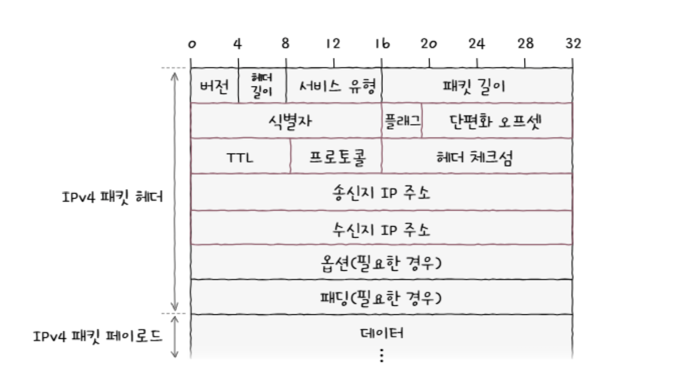
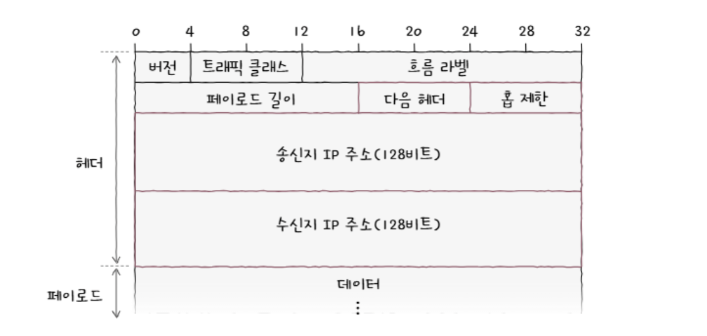
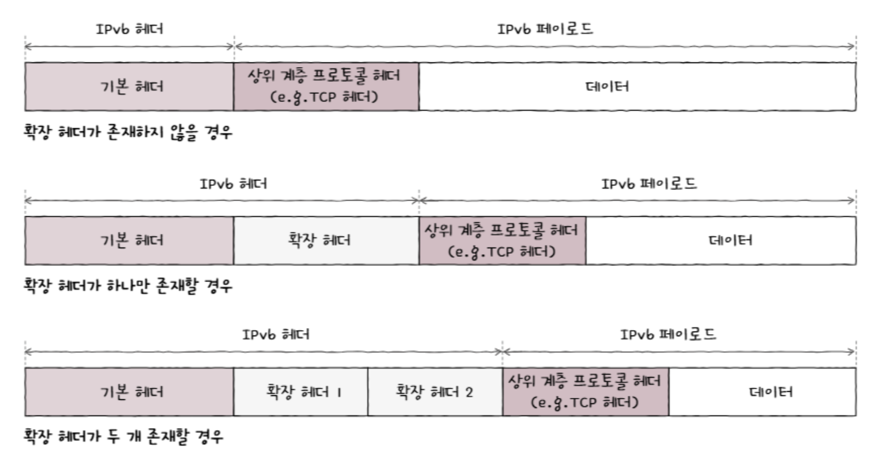

# LAN을 넘어서는 네트워크 계층
## 데이터 링크 계층의 한계
물리 계층과 데이터 링크 계층만으로 LAN을 넘어서 다른 도시나 다른 국가에 있는 친구와 통신할 수 있을까? -> 안됩니다.
 
왜요? 아래에서 확인해보세요

### 1. 물리 계층과 데이터 링크 계층만으로는 다른 네트워크까지의 도달 경로를 파악하기 어려움
물리 계층과 데이터 링크 계층은 LAN 내의 호스트끼리 통신하는 계층이지만, 우리는 LAN내의 호스트끼리만 통신하지 않는다. 멀리 떨어진 호스트와 통신하기 위해선 여러 네트워크 장비를 거쳐 통신해야 한다. 
네트워크 장비를 거쳐서 통신해야 하는데, 기왕이면 효율적인 경로라면 좋을 것이다. 이렇게 효율적인 경로를 결정하는 것이 라우팅(routing)이다. 이런 라우팅을 수행해 주는 네트워크 장비가 라우터(router)이다.

#### 2. MAC 주소만으로는 모든 네트워크에 속한 호스트의 위치를 특정하기 어렵다
현실적으로 모든 호스트가 모든 네트워크에 속한 모든 호스트의 MAC주소를 서로 알기란 어렵다. 따라서 호스트를 특정하기 위한 다른 추가적인 정보가 필요하다. 이것이 IP 주소이다. 네트워크에서는 MAC 주소와 IP주소를 함께 사용하고, 기본적으로 IP 주소를 우선적으로 활용한다.  
MAC주소를 물리 주소라고도 부르는 것처럼 IP주소를 논리 주소라고도 부른다. MAC 주소는 일반적으로 NIC마다 할당되는 고정된 주소지만, IP주소는 DHCP라는 특정 프로토콜을 통해 자동으로 할당받거나 사용자가 직접 할당할 수도 있고, 한 호스트가 복수의 IP 주소를 가질 수도 있다.

### 인터넷 프로토콜 (Internet Protocol = IP)
네트워크 계층의 가장 핵심적인 프로토콜이다. IPv4와 IPv6가 존재한다.

### IP주소
- 4바이트 (32비트)로 주소를 표기
- 점으로 구분된 8비트를 옥텟이라고 함

### IP의 기능
- IP 주소 지정(IP addressing) : IP주소를 바탕으로 송수신대상을 지정하는 것  
- IP 단편화(IP fragmentation) : 전송하고자 하는 패킷의 크기가 MTU보다 클 경우, MTU 크기 이하의 복수 패킷으로 나누는 것

### MTU란?
한 번에 전송 가능한 IP 패킷의 최대 크기. 일반적인 MTU 크기는 1500바이트, MTU 크기 이하로 나눠진 패킷은 수신지에 도착하면 재조합된다.  

### IPv4 패킷

 

**1. 식별자**  
패킷에 할당된 번호. 메시지 전송 과정에서 IPv4 패킷이 여러 조각으로 쪼개져서 전송되었을 때, 수신지에서 재조합하기 위해 식별자를 사용함
 

**2. 플래그**  
총 3개의 비트로 구성된 필드. 
- 첫 번째 비트는 항상 0으로 예약
- 두 번째 비트 중 하나는 DF (Don't Fragment), 1이면 IP, 단편화를 수행하지 않고 0이면 IP 단편화가 가능
- 나머지 비트는 MF (More Fragment), 0이면 이 패킷이 마지막 패킷임을 의미, 1이면 쪼개진 패킷이 더 있다는 것을 의미
 

**3. 단편화 오프셋**  
패킷이 단편화되기 전에 패킷의 초기 데이터에서 몇 번째로 떨어진 패킷인지 나타냄. 패킷이 순서대로 도착하지 않기 때문에 존재하며, 재조합 시 몇 번째 패킷인지 식별할 수 있음
 

**4. TTL**  
Time To Live, 패킷의 수명을 의미함. 통신을 위해 패킷이 호스트 또는 라우터에 전달되는 홉(hop)이라는 과정을 거친다. 이때 홉이 이루어질 때마다 TTL이 1씩 감소하며, 0이 되면 폐기된다. 이는 무의미한 패킷이 네트워크상에 지속적으로 남아있는 것을 방지하기 위해 존재한다.
 

**5. 프로토콜**  
상위 계층의 프로토콜이 무엇인지 나타내는 필드이다. 전송계층의 대표적인 프로토콜인 TCP는 6번, UDP는 17번이다.
 

**6. 송신지 IP 주소, 수신지 IP 주소**  
송수신지의 IPv4 주소를 알 수 있다.

### IPv6
- IPv4 주소로 할당할 수 있는 IP의 개수는 약 43억 개 
- 전 세계 인구가 하나씩 IP 주소를 가지고 있어도 부족하게 됨
- 심지어 일반적으로 한 사람이 사용하는 장치는 여러 개이기 때문에 고갈될 수 있다
- IPv6주소는 이론적으로 2의 128승만큼의 사실상 무한에 가까운 개수를 할당할 수 있음

**1. 다음 헤더**  
- 다음헤더는 상위 계층의 프로토콜을 가리키거나 확장 헤더를 가리킨다. 위에 명시된 이미지는 IPv6의 기본 헤더이며, IPv6는 확장 헤더를 통해 부가적인 데이터를 담을 수 있다.
- 확장 헤더는 꼬리에 꼬리를 물듯 또 다른 확장 헤더를 가질 수 있다. 
    - 송신지에서 수신지에 이르는 모든 경로의 네트워크 장비가 패킷을 검사하도록 하는 홉 간 옵션(Hop-by-Hop Options)
    - 수신지에만 패킷을 검사하도록 하는 수신지 옵션(Destination Options)
    - 라우팅 관련 정보를 운반하는 라우팅(Routing)
    - 단편화를 위한 단편화(Fragment)
    - 암호화 인증을 위한 ESP(Encapsulating Security Payload)
    - AH(Authentication Header) 확장 헤더가 있다.

 

**2. 홉 제한** 
IPv4 패킷의 TTL 필드와 비슷하게 패킷의 수명을 나타내는 필드이다.
 

**3. 송신지 IP 주소, 수신지 IP 주소**  
송수신지의 IPv6 주소 지정이 가능하다.