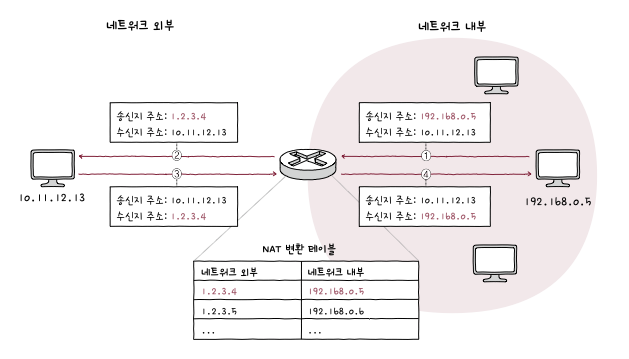
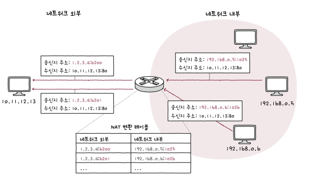

# IP의 한계와 포트

## IP의 한계

>신뢰할 수 없는 통신, 비연결형 통신  
>-> 전송 계층이 존재하는 이유!

#### 1. 신뢰할 수 없는 통신
    - IP는 통신 과정에서 패킷이 수신지까지 제대로 전송되었다는 보장을 하지 않는다.
    - 패킷 데이터가 손상, 중복 패킷이 전송되더라도 확인/재전송/순서보장 X
#### 2. 비연결형 통신
    - IP는 송수신 호스트 간 사전 연결 수립 작업을 거치지 않는다. 
    - 수신지 향해 패킷 보내기만 함.

>그럼 IP를 왜 이렇게 허술하게 만들어두었는가?  
> -> '빠른'성능을 우선시했기 때문.

## IP의 한계를 보완하는 전송 계층

#### 1. 연결형 통신 가능
    - **TCP** : 두 호스트가 정보를 주고 받기 전에 연결 수립. (연결형 프로토콜)
      - 송수신 동안 연결 유지, 송수신 끝나면 연결 종료

#### 2. 신뢰성 있는 통신
    - **TCP** : 패킷이 수신지까지 올바른 순서대로 확실하게 전달되는 것을 보장.
      - 재전송을 통한 오류 제어, 흐름 제어, 혼잡 제어 등 다양한 기능

>언제나 연결형 통신, 신뢰성 있는 통신이 좋은 것일까?  
>그건 아님. 높은 성능을 위해 **UDP**와 같이 신뢰할 수 없는, 비연결형 통신을 통해 빠른 전송을 선택하기도 함.

## 응용 계층과의 연결 다리, 포트

### 포트
> 외부에서 우리가 전송받으려는 사진 파일의 패킷들이 라우팅되어 우리 컴퓨터에 도착했다.  
> 우리는 컴퓨터로 웹 브라우저, 게임, 메신저를 실행하고 있었다고 하자.
> 사진 패킷들은 우리 컴퓨터에서 어느 프로세스로 전달되어야 할까? 

위의 상황에서 수신 어플리케이션에 대한 정보가 패킷에 포함되어있지 않다면 어느 프로세스로 가야할지 알 수 없을 것이다. 
*이 패킷이 어느 어플리케이션으로 가야하는지 식별할 수 있는 정보를 **포트**라고 한다.*

### 포트의 분류
전송 계층에서는 **포트 번호**를 통해 특정 애플리케이션을 식별한다. 
정확히는 패킷 내 **수신지 포트**와 **송신지 포트**를 통해 **송수신지** 호스트의 애플리케이션을 식별한다. 

포트 번호는 16비트로 표현 가능하며, 사용 가능한 포트의 수는 2¹⁶(65536)개 이다.

|포트 종류|포트 번호 범위|
|:-:|:-:|
|잘 알려진 포트|0~1023|
|등록된 포트|1024~49151|
|동적 포트|49152~65535|

#### 잘 알려진 포트
| 잘 알려진 포트 번호 | 설명 |
|:-:|:-:|
| 20, 21 | FTP |
| 22 | SSH |
| 23 | TELNET |
| 53 | DNS |
| 67, 68 | DHCP |
| 80 | HTTP |
| 443 | HTTPS |

#### 등록된 포트
| 등록된 포트 번호 | 설명 |
|:-:|:-:|
| 1194 | OpenVPN |
| 1433 | Microsoft SQL Server 데이터베이스 |
| 3306 | MySQL 데이터베이스 |
| 6379 | Redis |
| 8080 | HTTP 대체 |

#### 서버 프로그램과 클라이언트 프로그램의 포트
- 서버로 동작하는 프로그램은 대체로 잘 알려진 포트, 등록된 포트로 동작하는 경우가 많다.
- 클라이언트로 동작하는 프로그램은 동적 포트 번호, 임의 번호가 할당되는 경우가 많다.
  - 특정 웹 사이트에 접속한다면, 웹 브라우저 - 서버가 서로 패킷을 주고 받는 것과 같다.
  - 이때 웹 브라우저 프로그램에는 동적 포트 내의 임의 포트 번호가 자동으로 할당된다. 

>포트 번호 -> 실행 중인 '특정 애플리케이션' 식별 가능 
>IP 주소 + 포트 번호 -> '특정 호스트'에서 실행 중인 '특정 애플리케이션 프로세스' 식별 가능. 

-> 일반적으로 `IP주소:포트 번호` 형식으로 IP주소와 함께 표기된다.(`192.168.0.15:8000`) 

## 포트 기반 NAT

NAT란 IP 주소를 변환하는 기술  
주로 네트워크 내부에서 사용되는 사설 IP 주소와 네트워크 외부에서 사용되는 공인 IP 주소를 변환하는 데 사용.

### NAT 변환 테이블
IP 변환을 위해 주로 사용됨,, 
변환 대상이 되는 IP 주소 쌍이 명시되어 있다. 

그림의 NAT 테이블을 보면 `외부-내부`가 일대일로 대응되어 있다. 
이렇게 일대일 대응만으로는 많은 사설 IP 주소들을 변환하기에 무리데스. 
**하나의 공인 IP 주소로 여러 사설 IP 주소가 변환될 때 포트가 사용된다**

### NAPT
포트 기반의 NAT를 **NAPT(Network Address Port Translation)**이라고 한다. 
NAPT는 포트를 활용해 하나의 공인 IP 주소를 여러 사설 IP 주소가 공유할 수 있도록 하는 것이다. 
테이블에 변환할 IP 주소 쌍과 더불어 포트 번호도 함께 기록하고 변환한다. 
외부 IP 주소가 같더라도 포트 번호가 다르면 네트워크 내부 호스트를 특정할 수 있기 때문에 다수 사설 IP 주소를 적은 수의 공인 IP주소로 변환할 수 있게 된다.

## 더 알아보기
### 포트 포워딩
네트워크 내 특정 호스트에 IP 주소와 포트 번호를 미리 할당하고, 해당 `IP주소:포트번호`로써 해당 호스트에게 패킷을 전달하는 기능.  

>예를 들어 IP 주소가  `192.168.0.10`인 노트북에서 SpringBoot 서버를 실행했다고 해보자. 보통 8080포트가 할당되겠지?
>그러면 같은 와이파이(사설IP)에 있는 사람들은 `http://192.168.0.10:8080`으로 접속할 수 있다. 
>와이파이 밖에 있는 사람들이 접속하게 하려면 어떻게 해야할까? 
>공유기에서 포트 포워딩을 설정하면 됨. `http://공인IP:8080` -> `192.168.0.10:8080`으로 보내라 이런식으로

### ICMP
- IP의 신뢰할 수 없는 전송 특성, 비연결형 전송 특성을 보완하기 위한 **네트워크 계층**의 프로토콜
- IP 패킷의 전송 과정에 대한 피드백 메시지를 얻기 위해 사용.
- ICMP 메시지 종류
  - 1. 전송 과정에서 발생한 문제 상황에 대한 오류 보고
  - 2. 네트워크에 대한 진단 정보(네트워크상의 정보 제공)
- 타입과 코드로 정의됨
- 대표적으로 수신지 도달 불가, 시간 초과가 있음.
- *PING핑!*도 ICMP 기반의 명령어임! (네트워크 상태 진단 명령어)
- ICMP가 IP의 신뢰성을 보장하는 것은 아님.
  - 신뢰성 보완을 위한 도우미 역할일 뿐.
  - 신뢰성 완전히 보완하기 위해서는 전송 계층 프로토콜이 필요함.
