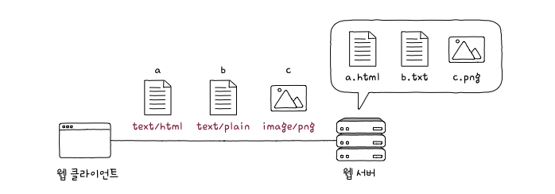
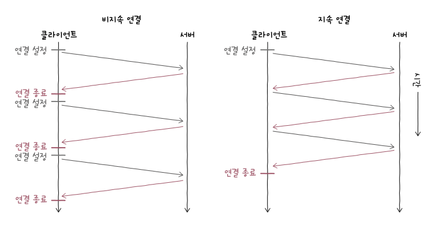
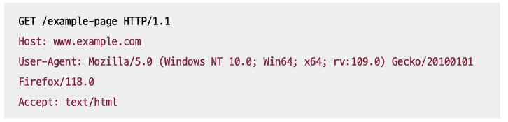
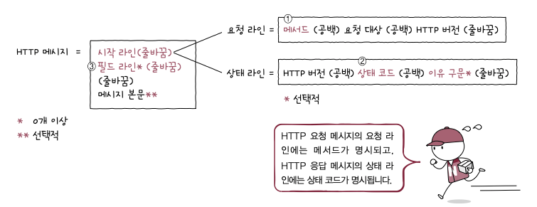

# http

> 1. 요청, 응답 기반 동작
> 2. 미디어 독립적
> 3. 상태 유지 X
> 4. 지속 연결 지원

## HTTP의 특성

#### 1. 요청-응답 기반 프로토콜

- `클라이언트-서버` 구조 기반 `요청-응답 `프로토콜
- 요청, 응답 형태 다름

#### 2. 미디어 독립적 프로토콜

> HTTP는 미디어 타입에 제한 두지 않고, 독립적으로 동작이 가능한 미디어 독립적 프로토콜이다.

- HTTP는 주고받을 자원의 특성과 무관
- 그 자원을 주고 받을 **수단** 의 역할을 수행.
- HTML, JPEG, PNG, JSON, XML, PDF 등

**미디어 타입**

- 웹에서 확장자와 같은 개념
- HTTP를 통해 송수신하는 정보의 종류를 나타내는 타입
- `type/subtype;parameter=value` 형식으로 구성

  - type: 데이터 유형
  - subtype: 세부 유형
  - parameter: 매개변수, 부가적인 설명 위해 선택적 포함
  - 예) `type/html;charset=UTF-8`
    - 미디어 타입: HTML 문서 타입
    - 문서 내 사용된 문자 : UTF-8로 인코딩
- 모든 미디어 타입 종류는 [링크]([www.iana.org/assignments/media-types](https://www.iana.org/assignments/media-types)) 에서 확인 가능

#### 3. 스테이트리스 프로토콜

- 서버가 HTTP 요청을 보낸 클라이언트와 관련된 상태를 기억하지 않음
- -> 모든 요청이 독립 요청으로 간주

**STATELESS!**

- 동시에 처리해야 할 요청이 많을 때, 모든 클라이언트의 상태 정보를 유지하는 건 서버에 부담.
- 여러 서버로 구성되어 있을 때, 서버가 모든 상태를 유지하면 서버끼리 상태 공유해야하며 동시에 클라이언트는 여러 서버를 동시에 이용하기 어려워짐.
- 상태 유지할 경우, 자신의 상태를 기억하는 서버하고만 상호작용 가능 -> 특정 서버에 종속

  - 서버 문제 발생 시, 그 서버에 종속된 클라이언트는 통신 내역 날라가는 것

**확장성과 견고성 (scalability & robustness)**

- 특정 서버에 종속 x -> 언제나 서버 추가 용이 -> 확장성
- 서버중 하나에 문제 생겨도 다른 서버로 대체 가능 -> 견고성

#### 4. 지속 연결 프로토콜

**초기 HTTP 버전 : 비지속 연결**

- HTTP는 TCP 상에서 동작
- HTTP는 비연결형, TCP는 연결형 프로토콜
- 3-way handshake 통해 TCP 수립 -> 요청 -> 응답 -> 종료
- 추가 요청 -> 응답 하기 위해서는 다시 연결해야 함.

**최근 HTTP(1.1이상) : 지속 연결(keep alive)**

- 비지속 연결에 비해 빠르게 여러 요청과 응답 처리 가능

## HTTP 메시지 구조

> 시작 라인
> 필드 라인(0개 이상)
>
> 메시지 본문(선택적)

#### 1. 시작 라인

- 요청 메시지일 경우 : **요청** 라인
  - `메서드 (공백) 요청 대상 (공백) HTTP버전 (줄바꿈)`
  - 메서드 : 수행할 작업의 종류 (GET, POST, PUT, DELETE,)
  - 요청 대상 : HTTP 요청 보낼 서버 자원 (URI)
    - 클라이언트가 `"http://www.example.com/hello?q=world"`로 보내면 요청 대상은 `"/hell?q=world"`.
  - HTTP 버전
- 응답 메시지일 경우: **상태** 라인
  - `HTTP 버전 (공백) 상태 코드 (공백) 이유 구문(선택적) (줄바꿈)`
  - HTTP 버전
  - 상태 코드: 요청에 대한 결과를 나타내는 세 자리 정수
  - 이유 구문: 상태 코드에 대한 문자열 형태의 설명.

#### 2. 필드 라인

- HTTP 헤더 : HTTP 통신에 필요한 부가 정보
- 각 헤더는 콜론`:`을 기준으로 `헤더 이름` 과 하나 이상의 `헤더값`으로 구성된다.

- 빨간 부분이 모두 헤더

#### 3. 메시지 본문

- 요청/응답 메시지에 본문이 필요할 경우 명시
- 존재하지 않을 수도 있고, 콘텐츠 타입이 사용될 수도 있음

